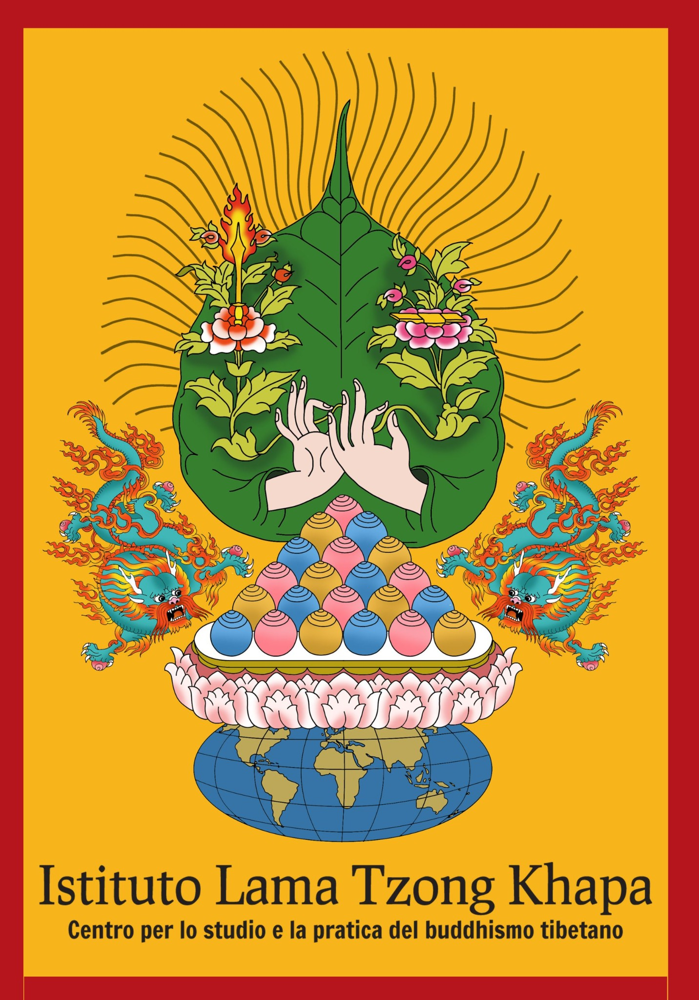

::: {.hero}
::: {.hero-inner}
::: {.hero-copy}

<i class="bi bi-mortarboard" aria-hidden="true"></i> Corso di perfezionamento post-laurea

# Meditazione, Compassione e Gestione Emozionale

Una formazione teorica ed esperienziale per integrare pratiche contemplative, psicologia e competenze relazionali nelle professioni di aiuto.

::: {.hero-actions}
[Scopri il corso](intro.qmd){.btn .btn-primary .btn-lg}
[Consulta il programma](programma.qmd){.btn .btn-outline-light .btn-lg}
:::

::: {.hero-meta}
<i class="bi bi-building" aria-hidden="true"></i> Università di Firenze + ILTK
<i class="bi bi-calendar3" aria-hidden="true"></i> Febbraio–aprile 2027
<i class="bi bi-people" aria-hidden="true"></i> 25 posti
:::
:::

::: {.hero-visual aria-hidden="true"}

<i class="bi bi-heart-pulse"></i>

:::
:::
:::

::: {.home-section .home-section--narrow}

Il progetto formativo

## Prendersi cura con maggiore consapevolezza

Il Corso propone un modello della mente e del funzionamento emotivo che ha origine nella tradizione della psicologia buddhista e offre strumenti metodologici e operativi per la pratica professionale e clinica dello psicologo e dell’operatore sanitario.

L’integrazione tra esperienze contemplative e clinica orientata alla Mindfulness sostiene una comprensione più profonda degli stati emotivi e delle modificazioni della coscienza che si manifestano sia nell’operatore sia nell’utente.
:::

::: {.home-section}

In sintesi

## Un percorso intensivo, concreto e relazionale

::: {.stats-grid}
::: {.stat-card}
6
incontri complessivi
:::
::: {.stat-card}
3
fine settimana residenziali a Pomaia
:::
::: {.stat-card}
25
posti disponibili
:::
:::

::: {.feature-grid}
::: {.feature-card}
<i class="bi bi-journal-text" aria-hidden="true"></i>

### Fondamenti teorici
Psicologia buddhista, Mindfulness, processi emotivi e modelli psicologici contemporanei.
:::
::: {.feature-card}
<i class="bi bi-flower1" aria-hidden="true"></i>

### Pratica esperienziale
Meditazioni guidate, esercizi contemplativi e lavoro diretto sulla consapevolezza.
:::
::: {.feature-card}
<i class="bi bi-people" aria-hidden="true"></i>

### Dimensione relazionale
Discussioni di gruppo e strumenti per una presenza empatica, equilibrata ed efficace.
:::
:::
:::

::: {.home-section .home-section--narrow}

A chi si rivolge

## Per le professioni fondate sulla relazione

Il corso è rivolto a persone interessate a migliorare le proprie competenze nell’ambito delle relazioni di aiuto e delle capacità empatiche. La conoscenza dei processi emotivi e della metodologia di gestione delle emozioni viene sviluppata in funzione delle capacità relazionali individuali.

[Leggi obiettivi, metodologia e requisiti](intro.qmd){.btn .btn-outline-primary}
:::

::: {.partner-strip}
<picture>
  <source srcset="images/iltk-logo.webp" type="image/webp">
  
</picture>
:::

::: {.cta-panel}
::: {}
## Informazioni e iscrizioni

Le domande sono accettate in ordine cronologico fino a esaurimento dei 25 posti disponibili. Scadenza indicata: **15 gennaio 2027**.
:::

[Scrivi alla segreteria](mailto:perfezionamento.meditazione@dss.unifi.it){.btn .btn-light .btn-lg}
:::
